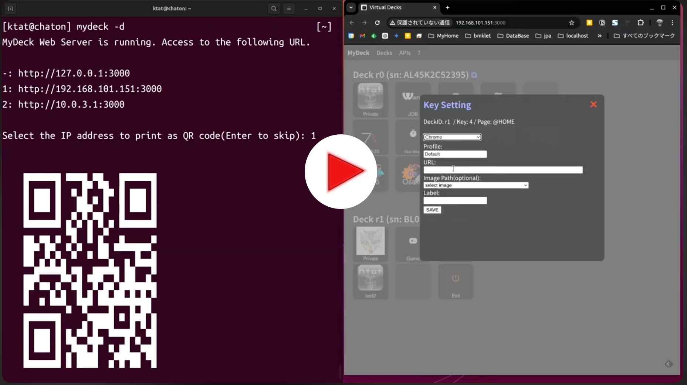

# MyDeck

English | [日本語](README.ja.md)

MyDeck allows you to configure a real STREAM DECK.
It also allows you to view and control the status of the actual STREAM DECK in your browser.
Even if you don't have a real STREAM DECK device, you can use it as a virtual external keyboard in the browser.

[](https://www.youtube.com/watch?v=PqSREyznhI4)

- To configure [STREAM DECK](https://www.elgato.com/ja/stream-deck) easily
- To use  virtual devices compatible with STREAM DECK
- Web Interface for virtual devices and real device

Check [the instruction](https://onlinux.systems/guides/20220520_how-to-set-up-elgatos-stream-deck-on-ubuntu-linux-2204) at first when you haven't setup STREAM DECK.

This package is intended primarily for Linux environments.
However, with the exception of one module (`app_window_check_linux`),
it does not depend on Linux at all.
It has not been tested on environments other than Ubuntu 22.04,
but I believe it can be used on other environments as well.

## Dependency

System packages:

- [xdotool](https://manpages.ubuntu.com/manpages/trusty/man1/xdotool.1.html) for active window checking (`app_window_check_linux`)
- ImageMagick libraries for `python3-wand`
- `cairo` / `libzbar0` (QR scanning for TOTP registration)
- GNOME Keyring (or any `secretstorage`-compatible backend) for TOTP secret storage

Ubuntu:

```
apt install xdotool libmagickwand-dev libcairo2-dev libzbar0 gnome-keyring
```

Python dependencies (installed automatically via `pip install .`):

- `streamdeck`, `Pillow`, `wand`, `cairosvg`
- `pyyaml`, `requests`, `qrcode`, `netifaces`
- `python-daemon`, `pidfile`, `psutil`
- `pyotp`, `pyzbar`, `keyring` (TOTP 2FA app)

## CAUTION

This is still alpha-quality software.

- Some code may not be idiomatic Python
- The API around `MyDeck` / `MyDecksManager` may change

## How to use?

If you don't have STREAM DECK device, no worry.

1. clone the code
1. do `pip install .` and `mydeck` command is installed
1. do `mydeck`
1. open `http://127.0.0.1:3000` to configure deck

### `mydeck` CLI options

| Option | Default | Description |
|---|---|---|
| `--port` | `3000` | Web server port |
| `--config-path` | `~/.config/mydeck` | Directory holding per-device YAML configs |
| `--log-level` | `INFO` | One of `DEBUG` / `INFO` / `WARNING` / `ERROR` / `CRITICAL` |
| `--vdeck` | off | Start with virtual decks even when no physical device is connected |
| `--no-qr` | off | Skip printing the QR code for the Web UI URL at startup |
| `-d` | off | Run as a daemon (PID file written under `--config-path`) |
| `--stop` | — | Stop a running daemon |
| `--restart` | — | Stop the running daemon and start a fresh one |

### Device resilience

If a STREAM DECK is unplugged (or the machine suspends/resumes), `mydeck` stays alive. A background supervisor re-enumerates every 3 seconds and reattaches the device as soon as it comes back, restoring the page and apps that were active before the disconnect. Devices whose serial is already known can also be started without being plugged in — they will attach automatically when connected.

### TOTP 2FA app (`AppTotp`)

Register TOTP accounts from the Web UI (manual secret, `otpauth://` URI, or QR image upload / camera scan), then display the current 6-digit code and a countdown ring across keys on the STREAM DECK. Secrets are stored in GNOME Keyring; account metadata under `~/.config/mydeck/totp_accounts.json`. A dedicated page `@TOTP_ACCOUNTS` is auto-created; link to it with `change_page: '@TOTP_ACCOUNTS'` on any key.

### Third-party apps (plugins)

`app:` and `game:` values in YAML accept either a short built-in name (`Clock` → `mydeck.app_clock.AppClock`) or a fully-qualified dotted path for out-of-tree packages:

```yaml
apps:
  - app: my_plugin.apps.Weather      # resolves to my_plugin.apps.Weather
    option:
      page_key:
        '@HOME': 3
games:
  - game: my_plugin.games.MyGame     # resolves to my_plugin.games.MyGame
```

To ship a plugin as its own package, install it into the same Python environment as `mydeck` (e.g. `pip install my_plugin`) and reference it by its import path. Your plugin class should subclass one of the base classes in `mydeck.my_decks_app_base` (`ThreadAppBase`, `BackgroundAppBase`, `HookAppBase`, `TouchAppBase`, `GameAppBase`) — see `docs/make_your_app.md` for the contract and lifecycle.

A working example of an external plugin (live CPU usage pie chart) is at [ktat/mydeck-hello-plugin](https://github.com/ktat/mydeck-hello-plugin).

## How to run example without install `mydeck` command

### If you have STREAM DECK device

```
PYTHONPATH=src python3 example/main.py
```
### If you don't have STREAM DECK device

```
PYTHONPATH=src python3 example/main_virtual.py
```

and open the following URL with browser.

http://localhost:3000/

If you want to change default port number 3000, pass port number as 1st argument.

```
PYTHONPATH=src python3 example/main_virtual.py 3001
```

## Configuration

### Virutal Deck Configuration

`mydeck` command configure it at first time when you use virtual deck. So you don't need to edit this manually.

```yaml
1: # ID
  key_count: 4
  columns: 2
  serial_number: 'dummy1'
2: # ID
  key_count: 6
  columns: 3
  serial_number: 'dummy2'
```

### Page Configuration Rule

You can edit config file with web interface.

```yaml
page_config:
  PAGE_LABEL:
    keys:
      KEY_NUMBER:
        "command": ["command", "options"]
        "chrome": ["profile name", "url"]
        "image_url": "https://example.com/path/to/image"
        "change_page: "ANOTHER_PAGE_NAME"
        "image": "image to display"
        "label": "label to display"
        "background_color": "white"
        "exit": 1
```

- PAGE\_LABEL ... Name of the page or name of active window
- KEY\_NUMBER ... It should be number, start from 0
- command ... OS command
- chrome ... launch chrome with profile. if image & image\_url is not set, check url root path + /faviocn.ico and use it as image if it exists.
- image\_url ... use url instead of image file path
- change\_page ... change page when the button is pushed
- image ... an image shown on button
- label ... a label shown on button below the image
- background\_color ... background color of the key
- exit ... can set 1 only. Exit app when the button is pushed

`command` and `change_page` can be used in same time.
In the case, command is executed and then page is changed.

#### Live reload of the YAML config

Config files are re-read automatically when their mtime changes, but only at the point `key_touchscreen_setup()` runs — which is on **page change**. There's no inotify-style filesystem watcher.

- Edits to an already-installed app (added/removed/repositioned keys, option changes): take effect the next time you switch pages on that deck.
- Installing a **new** Python package (e.g., a plugin under a new dotted path) requires **restarting `mydeck`** (`mydeck --restart -d`). Python only scans `site-packages` / `.pth` files at interpreter startup, so a running process can't discover a freshly-`pip install`ed plugin until it restarts.
- Editing code inside an already-loaded app (e.g., tweaking a built-in `app_*.py` file) likewise needs a restart — modules are cached in `importlib`.

#### PAGE\_LABEL

- `@HOME` is special label. This configuration is used for first page.
- `@GAME` is reserved label for the page to collect games.
- `@previous` is also special label. It can be used for the value of `change_page`. When the button is pushed, go back to the previous page whose name isn't started with `~`.

If you set window title as PAGE\_LABEL, page is changed according to active window.

#### example

##### configuration

```yaml
---
"apps":
  - app: Clock
    option:
      page_key:
        '@HOME': 5
        '@JOB': 12
  - app: StopWatch
    option:
      page_key:
        '@HOME': 6
  - app: Calendar
    option:
      page_key:
        '@home': 7
"alert":
   retry_interval: 60
   check_interval: 180
   key_config:
      7:
        command: ["google-chrome", '--profile-directory=Profile 1', 'https://example.com/nagios/cgi-bin/status.cgi?host=all&servicestatustypes=16&hoststatustypes=15']
        image: "./src/Assets/nagios.ico"
        change_page: '@previous'
"games":
  - game: RandomNumber
  - game: Memory
  - game: TicTackToe
  - game: WhacAMole
"page_config":
  "@HOME":
    keys:
      0:
        "change_page": "@PRIVATE"
        "label": "Private"
        "image": "./src/Assets/ktat.png"
      1:
        "change_page": "@JOB"
        "label": "Job"
        "image": "./src/Assets/job.png"
      2:
        "change_page": "@GAME"
        "label": "Game"
        "image": "./src/Assets/game.png"
      10:
        "label": "Config"
        "image": "./src/Assets/settings.png"
        "change_page": "@CONFIG"
      14:
        "exit": 1
        "image": "./src/Assets/exit.png"
        "label": "Exit"
  "@PRIVATE":
    keys:
      0:
        "command": ["google-chrome", "--profile-directory=Default"]
        "image": "/usr/share/icons/hicolor/256x256/apps/google-chrome.png"
        "label": "Chrome(PRIVATE)"
      10:
        "label": "Config"
        "image": "./src/Assets/settings.png"
        "change_page": "@CONFIG"
      14:
        "change_page": "@HOME"
        "image": "./src/Assets/home.png"
  "@JOB":
    keys:
      0:
        "command": ["google-chrome", '--profile-directory=Profile 1']
        "image": "/usr/share/icons/hicolor/256x256/apps/google-chrome.png"
        "label": "Chrome(JOB)"
  "@CONFIG":
    keys:
      0:
        "label": "Audio"
        "command": ["pavucontrol", "--tab=4"]
        "image": "./src/Assets/audio.png"
      1:
        "label": "Sound"
        "command": ["gnome-control-center", "sound"]
        "image": "./src/Assets/sound.png"
      2:
        "label": "Display"
        "command": ["gnome-control-center", "display"]
        "image": "./src/Assets/display.png"
      14:
        "change_page": "@previous"
        "image": "./src/Assets/back.png"
        "label": "Back"
  "Meet - Google Chrome":
    keys:
      0:
        "command": ["echo", "meet"]
        "image": "./src/Assets/meet.png"
        "label": "Google Meet"
      1:
        "command": ["xdotool", "key", "ctrl+d"]
        "image": "./src/Assets/mute.png"
        "label": "mute"
      2:
        "command": ["xdotool", "key", "ctrl+e"]
        "image": "./src/Assets/video.png"
        "label": "camera"
      10:
        "label": "Audio"
        "command": ["pavucontrol", "--tab=4"]
        "image": "./src/Assets/audio.png"
      11:
        "label": "Sound"
        "command": ["gnome-control-center", "sound"]
        "image": "./src/Assets/sound.png"
      14:
        "change_page": "@JOB"
        "label": "Back"
        "image": "./src/Assets/back.png"
  "Zoom Meeting":
    kyes:
      0:
        "command": ["echo", "zoom"]
        "image": "./src/Assets/zoom.png"
        "label": "Zoom"
      1:
        "command": ["xdotool", "key", "alt+a"]
        "image": "./src/Assets/mute.png"
        "label": "mute"
      2:
        "command": ["xdotool", "key", "alt+v"]
        "image": "./src/Assets/video.png"
        "label": "camera"
      10:
        "label": "Audio"
        "command": ["pavucontrol", "--tab=4"]
        "image": "./src/Assets/audio.png"
      11:
        "label": "Sound"
        "command": ["gnome-control-center", "sound"]
        "image": "./src/Assets/sound.png"
      14:
        "change_page": "@JOB"
        "label": "Back"
        "image": "./src/Assets/back.png"
```

### main script

```python
from mystreamdeck import *

import os

CHECK_URL = 'https://example.com/'

def check_alert():
    res = requests.get(CHECK_URL)
    if res.status_code != requests.codes.ok:
        return True
    return False

if __name__ == "__main__":
    mydecks = MyStreamDecks(
        {
            'server_port': 3001, # default is 3000
            'config': {
               'file': "./example/config/config.yml",
               'alert_func': check_alert,
            },
      	}
    )

    mydecks.start_decks()

    os.exit()
```

If you have multi devices.

```python
if __name__ == "__main__":
    mydecks = MyStreamDecks({
        'server_port': 3001, # default is 3000
        'decks': {
            'SERIAL_KEY_1': 'name1',
            'SERIAL_KEY_2': 'name2',
        },
        'configs': {
            'name1': {
                'file': "/path/to/config1.yml",
                'alert_func': check_alert,
            },
            'name2': {
                'file': "/path/to/config2.yml",
            },
        }
    })

    mydecks.start_decks()
```

If you don't have real devices.

```yaml
if __name__ == "__main__":
    mydecks = MyStreamDecks({
        'vdeck_config': "example/config/vdeck.yml",
        'decks': {
            'dummy1': '4key-dummy',
            'dummy2': '6key-dummy',
            'dummy3': '15key-dummy',
        },
        'configs': {
            '6key': {
                'file': "example/config/config2.yml",
            },
            '4key-dummy': {
                'file': "example/config/config-d1.yml",
            },
            '6key-dummy': {
                'file': "example/config/config-d2.yml",
            },
            '15key-dummy': {
                'file': "example/config/config.yml",
                'alert_func': check_alert,
            },
        }

    })

    mydecks.start_decks(True)
```

## LICENSE

MIT: https://ktat.mit-license.org/2016

## SEE ALSO

### python-elgato-streamdeck repository

https://github.com/abcminiuser/python-elgato-streamdeck

### icons

Some of icon are from the fowlloing:
https://remixicon.com/
